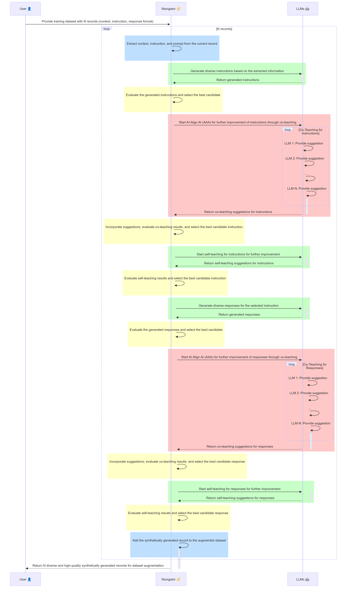

# Navigator Self-Align 🚀

Navigator Self-Align is a Python library for augmenting training data via synthetic data generation for large language models (LLMs). It leverages techniques such as diverse instruction and response generation, and an AI alignment process as described in the WizardLM-2 paper, to iteratively enhance data quality. The system integrates multiple LLMs in a co-teaching and self-improvement process, generating diverse and high-quality synthetic instructions, responses, and leverages evaluations for quality, adherence, toxicity, and bias.

## Features

- **Diverse Instruction Generation**: Generates diverse instructions based on given context and optionally provided instructions.
- **Diverse Response Generation**: Generates diverse responses based on given context and instructions.
- **AI Alignment Process**: Optionally improves generated instructions and responses using a co-teaching and self-teaching approach. While this process can add significant compute time, it generates the highest quality results in practice.
  - **Co-Teaching**: Iteratively improves the text using multiple language models.
  - **Self-Teaching**: Generates improvement suggestions and applies them to the text.
- **Quality and Fairness Judgements**: Navigator Self-Align evaluates the generated text on five dimensions:
  - **Conformance**: Measures how well the generated text aligns with the provided tags and descriptions.
  - **Quality**: Assesses the grammatical correctness, coherence, and relevance of the generated text.
  - **Toxicity**: Detects the presence of toxic content in the generated text.
  - **Bias**: Identifies any unintended biases in the generated text.
  - **Groundedness**: Evaluates the factual correctness of the generated text.
  
  A composite score is computed based on these dimensions, and the best-scoring text from each batch of generations is selected for the following steps.
- **Gretel Navigator Compound AI system and LLMs**: Used for synthetic data generation and evaluation of generated text. In fact, multiple LLMs and Navigator are leveraged to generate diverse and high quality results, leveraging the strengths and capabilities of any connected LLM to improve results.

## Installation

1. Clone the repository:

   ```bash
   git clone https://github.com/gretelai/navigator-self-align.git
   cd navigator-self-align
   ```

2. Create a virtual environment and activate it:

   ```bash
   python3 -m venv venv
   source venv/bin/activate
   ```

3. Install the required dependencies:

   ```bash
   pip install -r requirements.txt
   ```

## Usage

### Input Requirements

The input to this program is LLM training data in a pandas DataFrame format. You must specify one or more context columns, an instruction column, and a response column.

### Command-line Arguments

- `--loglevel`: Set the logging level (default: `INFO`).
- `--disable_aaa`: Disable the AI Alignment process to improve runtime (default: `False`).

### Example Command

```bash
python main.py --loglevel INFO --disable_aaa
```

## Configuration

The data augmentation configuration is created using the `DataAugmentationConfig` class. This includes setting the number of instructions and responses to generate, temperature, token limits, and specifying the API key, primary model, and maximum number of co-teaching LLMs.

Fields are added to the configuration to specify the context, instruction, and response columns.

Example:

```python
config = DataAugmentationConfig(
    num_instructions=5,
    num_responses=5,
    temperature=0.8,
    max_tokens_instruction=100,
    max_tokens_response=150,
    api_key=API_KEY,
    primary_model=PRIMARY_MODEL,
    max_co_teach_llms=MAX_CO_TEACH_LLMS,
    co_teach_models=CO_TEACH_MODELS,
    instruction_format_prompt="A well-formulated question or command in everyday English.",
    response_format_prompt="A well-formulated response to the question in everyday English.",
)
config.add_field("context", field_type="context")
config.add_field("instruction", field_type="instruction")
config.add_field("response", field_type="response")
```

## Data Augmentation Process

The data augmentation process involves the interaction between the User, Navigator Agent, and LLMs. Here's a sequence diagram illustrating the process:



1. Data Extraction and Initial Generation:
- Extract context, instruction, and response format from each record.
- Generate diverse instructions using LLMs.
- Evaluate and select the best candidate instruction.

2. Instruction Improvement (AAA):
- Apply Co-Teaching to the selected instruction using multiple LLMs.
- Incorporate suggestions and evaluate Co-Teaching results.
- Apply Self-Teaching to further improve the instruction.
- Evaluate and select the best candidate instruction.

3. Response Generation and Improvement:
- Generate diverse responses for the selected instruction.
- Evaluate and select the best candidate response.
- Apply Co-Teaching to the selected response using multiple LLMs.
- Incorporate suggestions and evaluate Co-Teaching results.
- Apply Self-Teaching to further improve the response.
- Evaluate and select the best candidate response.

4. Final Augmentation:
- Add the synthetically generated record to the augmented dataset.
- Return the augmented dataset to the user.

## Contributing

Contributions are welcome! Please feel free to submit a pull request or open an issue.

## License

This project is licensed under the Gretel License. See the `LICENSE` file for details.

## Acknowledgements

This project was inspired by the techniques described in the following papers and blog posts:

- Shazeer et al. "WizardLM-2: Empowering Large Language Models with Diverse Knowledge and Progressive Learning." WizardLM 2, 15 Apr. 2024, https://wizardlm.github.io/WizardLM2/.
- Yuan et al. "Self-Rewarding Language Models." arXiv preprint arXiv:2401.10020 (2024).
- Wei et al. "StarCoder2-Instruct: Fully Transparent and Permissive Self-Alignment for Code Generation." Hugging Face Blog, 29 Apr. 2024, https://huggingface.co/blog/sc2-instruct.
- Li et al. "Textbooks Are All You Need II: phi-1.5 technical report." arXiv preprint arXiv:2309.05463 (2023).

We would like to express our gratitude to the authors of these works for their valuable insights and contributions to the field of large language model training and data augmentation.
